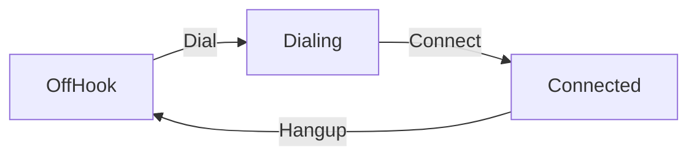

# Machinery

Create simple state machines in Go

```go
	offHook := machinery.NewState("OffHook")
	dialing := machinery.NewState("Dialing")
	connected := machinery.NewState("Connected")
	callInProgress := false
	connected.OnEntry(func() error {
		callInProgress = true
		return nil
	})
	connected.OnExit(func() error {
		callInProgress = false
		return nil
	})

	blueprint := machinery.NewBlueprint()
	blueprint.Connect(offHook, dialing, "Dial")
	blueprint.Connect(dialing, connected, "Connect")
	blueprint.Connect(connected, offHook, "Hangup")

	machine := machinery.NewMachine(blueprint, offHook)
	Expect(machine.State()).To(Equal(offHook))

	machine.Fire("Dial")
	Expect(machine.State()).To(Equal(dialing))

	machine.Fire("Connect")
	Expect(machine.State()).To(Equal(connected))
	Expect(callInProgress).To(BeTrue())

	machine.Fire("Hangup")
	Expect(machine.State()).To(Equal(offHook))
	Expect(callInProgress).To(BeFalse())
```

Produces a state machine analogous to the following:



When the `Connected` state is entered, the `OnEntry` function is executed to set `callConnected` to true, and symmetrically, to `false` when the `OnExit` function is executed. Errors returned from these functions are propagated out of the `Fire` function e.g.

```go
	blueprint := NewBlueprint()
	start := NewState("start")
	end := NewState("end")

	end.OnEntry(func() error {
		return errors.New("EXPLODED")
	})
	blueprint.Connect(start, end, "trigger")

	machine := NewMachine(blueprint, start)
	Expect(machine.Fire("trigger")).To(MatchError("EXPLODED"))
```

Expectations in the code above are provided by [Gomega](https://github.com/onsi/gomega)
